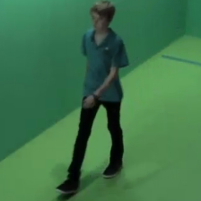
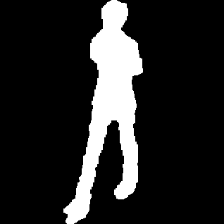
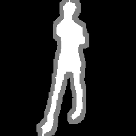

# Generate Alpha Matte for OUMVLP

## Requirements
#### Packages:
- torch >= 1.1
- tensorboardX
- numpy
- opencv-python
- toml
- easydict
- pprint

### Trimap Preparation
Trimap is the user defined area where the alpha matte is estimated.

Given the coarse segmentation mask(the middle), we obtain trimap(the right) by eroding both the foreground area and background area.

<p align="center">
  
  
  
</p>

'fg_kernel' is the required parameter in the matrix describing to what extend the foreground area of the coarse segmentation mask is eroded as the defined foreground. 'bg_kernel' works in a similar way.

You can set this parameter according to your desired resolution.


```bash
# For a single subject in all views, change the dir for bash

python gen_trimap.py 
```
### Generate the alpha matte

Clone this repo, and download the checkpoint from Lotus server `zhang\matting_ckpt\`

```bash
 # For a single subject in all views, change the dir for bash

 python demo.py --image-dir <YOUR_RGB_DIR_TOSUBJECT> \
                --trimap-dir <YOUR_TRIMAP_DIR_TOSUBJECT> \
                --output <YOUR_OUTPUT_DIR> \
                --checkpoint ./checkpoints/best_model.pth 
```
The predictions will save to `result` folder in structure:
```bash
 result 
 |_ alpha
   |_ 00001
     |_ 000_00
       |_ 0021.jpg
       |_ ...
     |_ ...
   |_ ...  
 |_ bin_extract
 |_ matt_extract
 |_ pred_bg
 |_ pred_fg

```